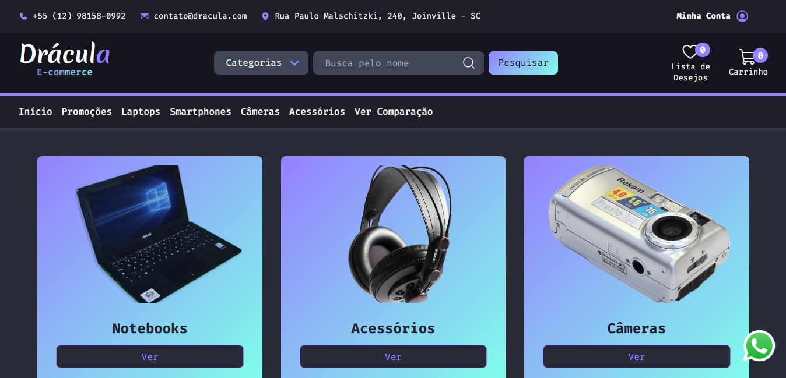

# Drácula E-commerce
Transforme seu lar em um castelo das trevas com os eletrônicos do e-commerce Drácula.

## Coisas para fazer:
* implementar meio de pagamento com Stribe
* Responsividade
* site de referência: https://technext.github.io/feane/

> ## Bibliotecas e Ferramentas

* Typescript
* React
* React Testing Library
* React Router DOM
* Cypress
* Vitest
* Axios
* Git

> ## Features do React

* Functional Components
* UseState
* UseContext
* UseEffect

> ## Features de Testes

* Testes Unitários
* Testes e2e
